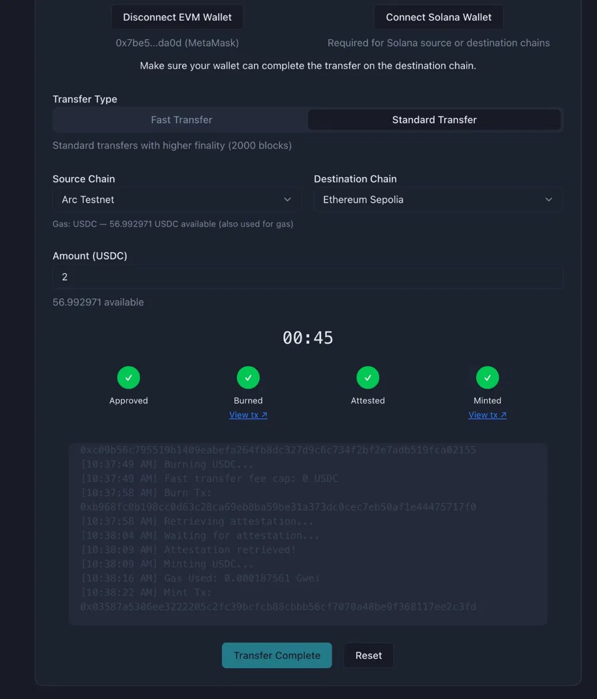

# Arc CCTP Bridge

> Cross-chain USDC on Circle CCTP v2

A USDC cross-chain bridge with Arc Testnet support, forked from Circle's official CCTP sample app and extended with Arc-specific fixes and UX improvements.

**Live demo:** [arc-cctp-bridge.vercel.app](https://arc-cctp-bridge.vercel.app)



---

## What's different from upstream

The upstream [`circlefin/circle-cctp-crosschain-transfer`](https://github.com/circlefin/circle-cctp-crosschain-transfer) already includes Arc Testnet in its chain list. This fork adds three Arc-specific fixes that make the bridge actually usable on Arc Testnet:

### Fix 1 — Gas token display: USDC, not ETH

Arc Testnet uses USDC as its native gas token (not ETH). The upstream doesn't surface this difference — users on Arc would see misleading ETH-centric labels. This fork adds a `getGasTokenSymbol()` helper that reads `nativeCurrency.symbol` from each chain's viem definition and displays the correct token under the source chain selector. On Arc: `Gas: USDC`. On Ethereum Sepolia: `Gas: ETH`.

### Fix 2 — Auto-add Arc Testnet to wallet (EIP-3085)

If a user's wallet hasn't added Arc Testnet yet, `wallet_switchEthereumChain` returns error code `4902` and the UI breaks silently. This fork catches error `4902`, calls `wallet_addEthereumChain` with the correct Arc Testnet parameters (sourced from the viem `arcTestnet` chain definition), then retries the switch. Users get a MetaMask "Add Network" prompt instead of a silent failure.

### Fix 3 — Detailed attestation progress: spinner, timer, tx links

The upstream renders a static 4-step indicator with no feedback during execution. This fork replaces it with:
- **Dynamic labels** per step state (active: "Burning USDC...", done: "Burned")
- **Spinner animation** on the active step instead of a static number
- **Elapsed timer** during the attestation step ("Waiting for Circle attestation... 14s") so users know the app is working, not frozen
- **Clickable transaction links** for burn and mint steps, opening the correct block explorer for each chain (Arc Testnet → [ArcScan](https://testnet.arcscan.app))

---

## Tech stack

| Layer | Technology |
|-------|-----------|
| Framework | Next.js 16 (App Router) |
| Language | TypeScript |
| EVM client | viem |
| Wallet | MetaMask / any EIP-6963 wallet |
| Styling | Tailwind CSS + shadcn/ui |
| Deploy | Vercel |

---

## Setup

```bash
git clone https://github.com/hoanghieu512/arc-cctp-bridge.git
cd arc-cctp-bridge
npm install
npm run dev
```

Open [http://localhost:3000](http://localhost:3000).

**No environment variables required.** The app uses browser wallets (MetaMask via EIP-6963) — no server-side keys needed.

---

## Supported chains

| Chain | CCTP Domain | USDC Address |
|-------|------------|--------------|
| Arc Testnet | 26 | `0x3600000000000000000000000000000000000000` |
| Ethereum Sepolia | 0 | `0x1c7D4B196Cb0C7B01d743Fbc6116a902379C7238` |
| Base Sepolia | 6 | `0x036CbD53842c5426634e7929541eC2318f3dCF7e` |

The app also supports Arbitrum Sepolia, Avalanche Fuji, Optimism Sepolia, Polygon Amoy, and other testnets inherited from upstream. The three chains above are the verified routes tested with Arc Testnet.

---

## Verified routes

All four Arc Testnet routes verified June 2026.

| Route | Status | Burn tx | Mint tx |
|-------|--------|---------|---------|
| Arc Testnet → Ethereum Sepolia | ✅ Pass | [`0xb968fc0b198cc0d63c28ca69eb8ba59be31a373dc0cec7eb50af1e44475717f0`](https://testnet.arcscan.app/tx/0xb968fc0b198cc0d63c28ca69eb8ba59be31a373dc0cec7eb50af1e44475717f0) | [`0x03587a5306ee3222205c2fc39bcfcb88cbbb56cf7070a48be9f368117ee2c3fd`](https://sepolia.etherscan.io/tx/0x03587a5306ee3222205c2fc39bcfcb88cbbb56cf7070a48be9f368117ee2c3fd) |
| Arc Testnet → Base Sepolia | ✅ Pass | [`0xf4a8b805bf38d9b852a16d5beac48af1397f913f04d2ce750930a3a7022d5283`](https://testnet.arcscan.app/tx/0xf4a8b805bf38d9b852a16d5beac48af1397f913f04d2ce750930a3a7022d5283) | [`0x4b30c48cc65fa0ad7e8d6713442fbc37302ebb8be6f56c1fb12a0c4ea8c40ae3`](https://sepolia.basescan.org/tx/0x4b30c48cc65fa0ad7e8d6713442fbc37302ebb8be6f56c1fb12a0c4ea8c40ae3) |
| Base Sepolia → Arc Testnet | ✅ Pass | [`0x45f6e0f5dec193a51aa29e1f51e2286eb76df1283bc99ef9648b71bb3d260dd2`](https://sepolia.basescan.org/tx/0x45f6e0f5dec193a51aa29e1f51e2286eb76df1283bc99ef9648b71bb3d260dd2) | [`0x012ad67ca3a8e38089344ff339f4f721a96f5f4f09010ada224e29e84fcaf0af`](https://testnet.arcscan.app/tx/0x012ad67ca3a8e38089344ff339f4f721a96f5f4f09010ada224e29e84fcaf0af) |
| Ethereum Sepolia → Arc Testnet | ✅ Pass | [`0xbd6060960c569687a10b0658e08a484fb0663b83d8ae86f17f2290eb89b85e20`](https://sepolia.etherscan.io/tx/0xbd6060960c569687a10b0658e08a484fb0663b83d8ae86f17f2290eb89b85e20) | [`0x8bc332aa4aec1998acf8b6cb565b97823a8fada3cfdfc4466aca1cc45c7778a1`](https://testnet.arcscan.app/tx/0x8bc332aa4aec1998acf8b6cb565b97823a8fada3cfdfc4466aca1cc45c7778a1) |

---

## Known limitations

- **Solana UI present, EVM-only scope.** The Connect Solana Wallet button is inherited from upstream. Solana routing is out of scope for this fork — only EVM chains are actively maintained and tested.
- **Public Sepolia RPC rate limits.** The app uses public RPC endpoints. Under load, the burn step can fail with HTTP errors on Ethereum Sepolia or Base Sepolia. Use a private RPC endpoint (Alchemy, Infura) via `NEXT_PUBLIC_ETH_SEPOLIA_RPC_URL` if you hit this.
- **Arc CCTP attestation status.** Arc Testnet CCTP attestation was confirmed working June 2026. Arc is an active testnet; Circle's attestation API support may evolve ahead of Arc mainnet launch.

---

## Credits

Forked from **[circlefin/circle-cctp-crosschain-transfer](https://github.com/circlefin/circle-cctp-crosschain-transfer)** by Circle Internet Group, Inc.

Licensed under the [Apache License 2.0](LICENSE).

This fork adds Arc Testnet support and Arc-specific UX fixes on top of Circle's reference implementation. All upstream code remains under the original Apache 2.0 license. Arc Testnet contract addresses sourced from [docs.arc.io](https://docs.arc.io).
